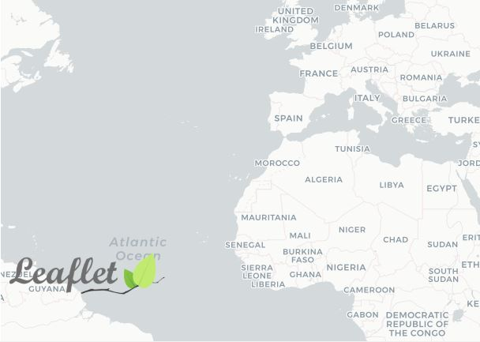

# CustomControlLeaflet

This project was generated with [Angular CLI](https://github.com/angular/angular-cli) version 9.1.0 along with [Leaflet](https://leafletjs.com/) version 1.6.0. This project is a simple web-GIS application to add a new Control (i.e. Watermark") to map based on [this](https://leafletjs.com/examples/extending/extending-3-controls.html) Leaflet tutorial.

## App Preview Shot

